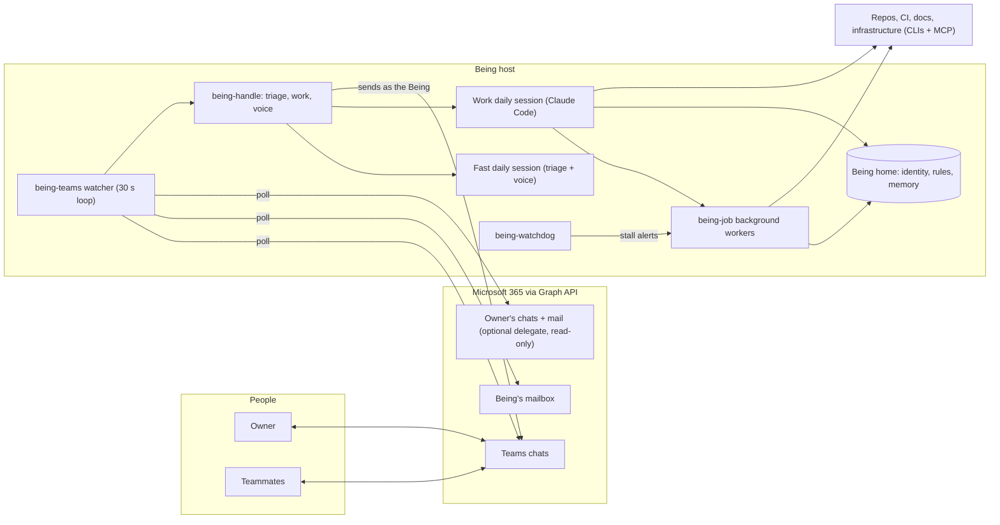
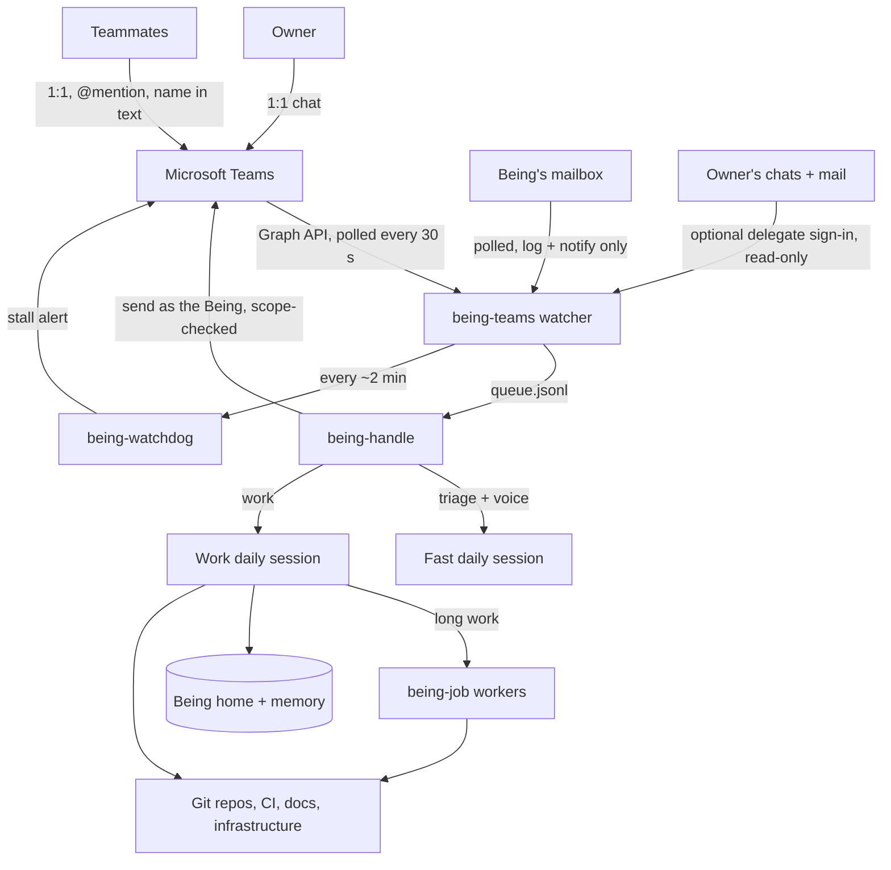
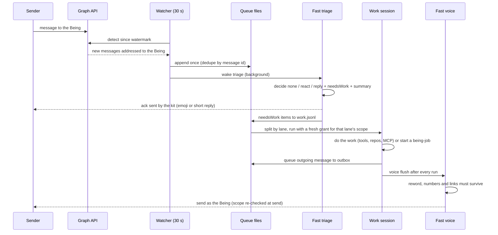
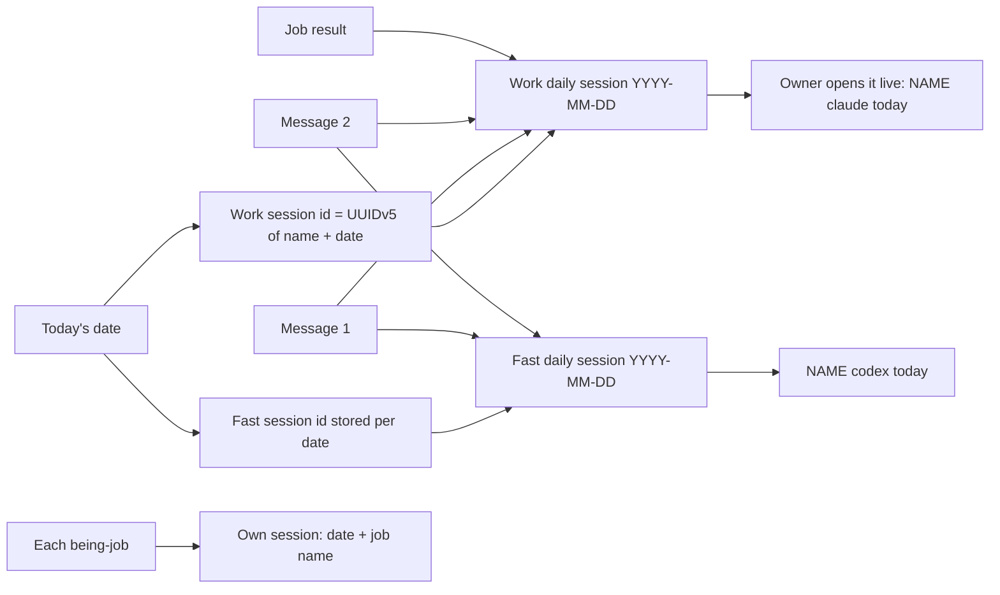
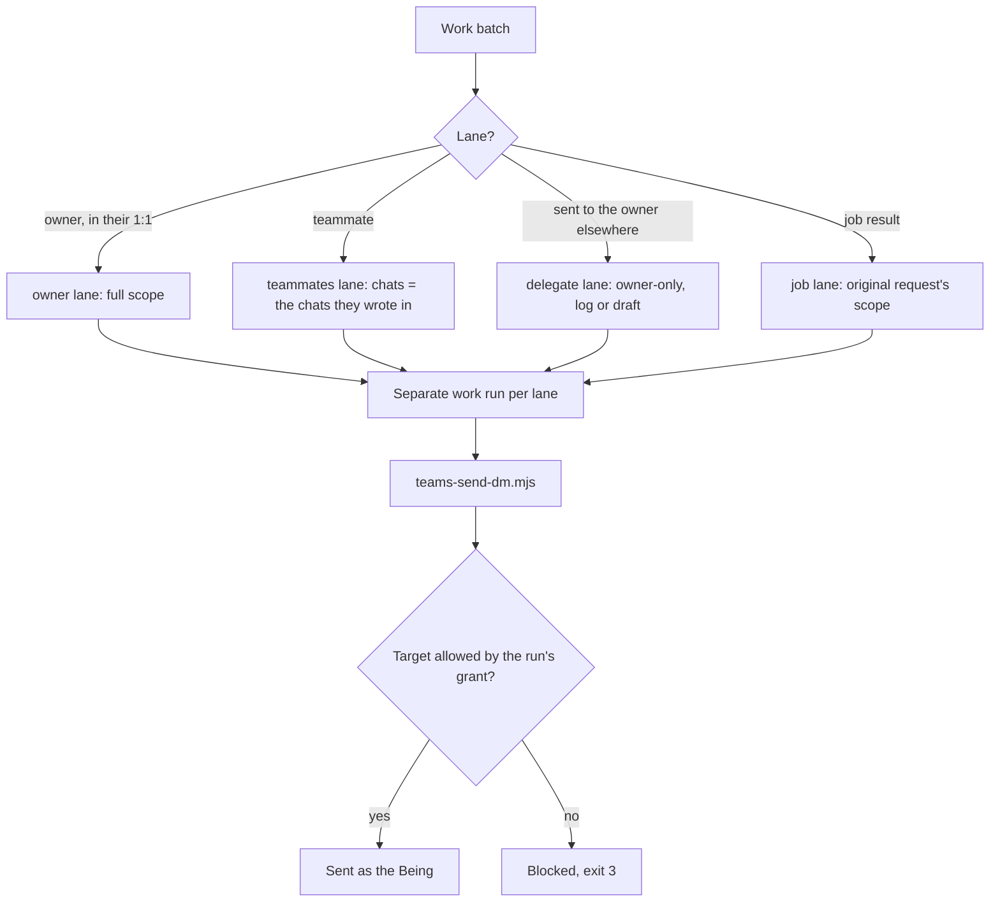
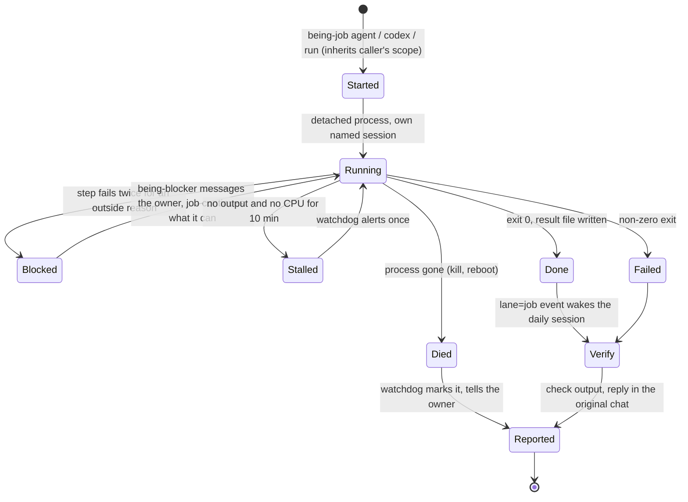
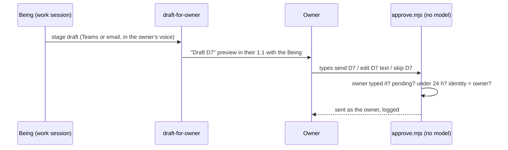
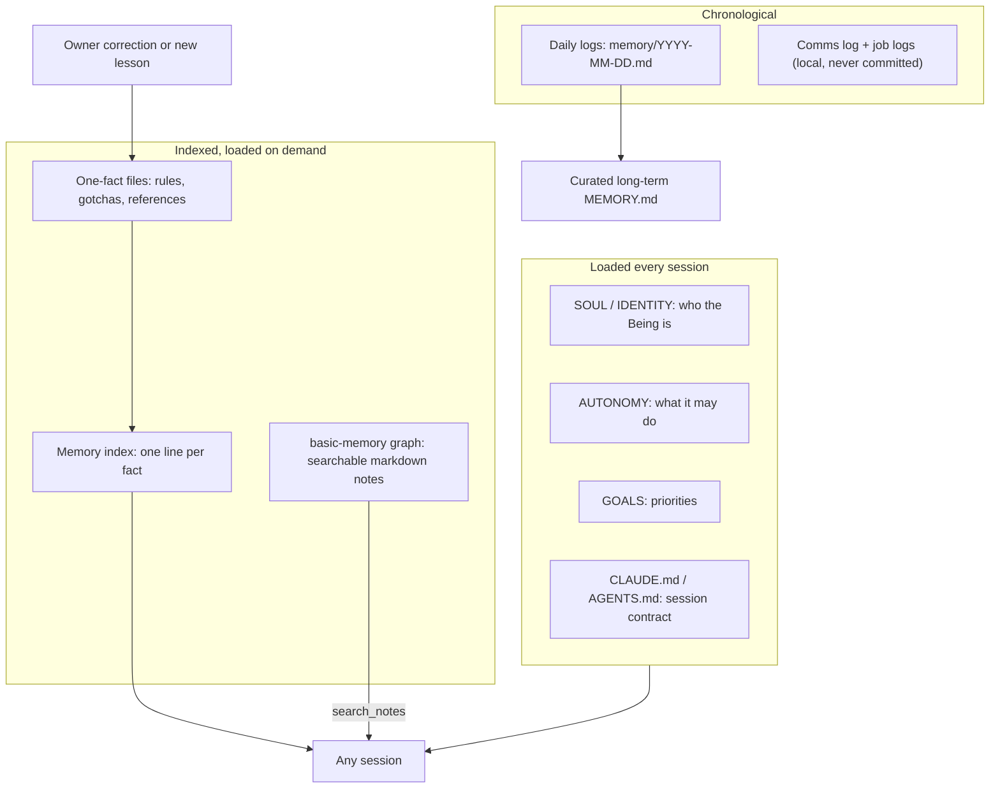
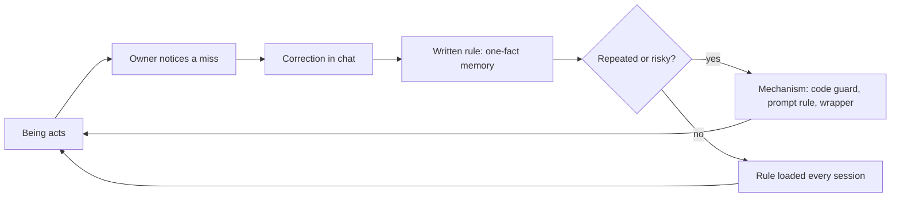

# Architecture — A Being That Works With a Team

How a Global Being with the [Operations Kit](OPERATIONS_KIT.md) runs end to end: how it watches chat, decides how to
respond, does the work, routes models, runs long jobs, stays inside guardrails, remembers, and improves. Names used here
are the kit's: the **Being** (the AI), its **owner** (the human partner) and **teammates** (everyone else who messages it).
Script names refer to [`skills/teams-kit/`](../skills/teams-kit/). If this page and the code disagree, the code wins.

## What a Being is

A Being is not one program. It is a set of **plain files** (identity, rules, memory) in a git repo, plus a **small kit of
shell, Node and Python scripts** that connect two AI coding clients, **Claude Code** and **Codex**, to Microsoft Teams,
mail and the team's engineering tools. The [protocol](PROTOCOL_SPEC.md) supplies identity and memory; the kit adds the
operational layer: the Teams pipeline, daily sessions, lanes and send scopes, a job runner, a watchdog, blockers, and a
one-fact memory index fed by owner corrections.

## The system in one picture

## Key choices

| Aspect | Choice |
|---|---|
| Teams polling | Every **30 s** over Microsoft Graph; the watermark advances only after a clean sweep |
| Presence | Refreshed every ~5 min (expires in 15), so the Being shows Available only while the watcher runs |
| Watchdog | Every ~2 min; one alert if a job or run shows no activity for **10 min** (`BEING_STALL_MIN`) |
| Sessions | **One fast session + one work session per date**, named `YYYY-MM-DD`; every message that day resumes them |
| Pipeline | **Triage** (fast model, read-only) → **Work** (strong model) → **Voice** (fast model rewords outgoing messages) |
| Lanes | owner · teammates · delegate · job, each with its own send scope enforced in code |
| Long work | `being-job` detached workers (Claude Code or Codex), verified by the daily session before reporting |
| Blockers | A step fails twice for an outside reason → stop and message the owner with the exact error |

## 1. System context

Who talks to the Being, through what, and what it can reach.

## 2. Teams monitoring and response pipeline

### Watching: `being-teams`

One long-running loop (optionally a systemd user unit, so it survives reboots) that ticks every **30 seconds**:

- **Detect** new messages addressed to the Being: 1:1 chats, @mentions, its name in text, and reactions on its messages.
  A message is queued **once** (deduplicated by message id; the queue lives on disk). A transient failure on any chat keeps
  the old watermark, so nothing is lost.
- **Delegate watch** (optional): with the owner's separate read-only sign-in, messages *sent to the owner* are queued on
  the delegate lane as log entries or draft candidates.
- **Mail**: new mail in the Being's mailbox is logged and a desktop notification raised. Mail is **never auto-answered**.
- **Presence**: refreshed every ~5 min with a 15 min expiry, so the Being shows Available only while the watcher runs.
- **Watchdog**: every ~2 min (see [Background jobs](#5-background-jobs-and-verification)).
- **Warm-up**: if today's fast session does not exist yet, it is opened ahead of the first message so the first
  acknowledgement is fast.

A `state/STANDBY` marker makes a second host read-only (no loop, no sends) during a machine cutover.

### Responding: `being-handle` in three stages

**1. Triage** (fast model, read-only, low effort, seconds). For each message the model returns schema-validated JSON:
`action` (**none**, **react** with a fitting emoji, or **reply** with 1-2 specific sentences), `needsWork`, and a
`summary` for the work step. Rules in the prompt:

- **Never react to a question.** A 👍 on "can you…?" can read as a yes or a brush-off. Questions get no ack (the work step
  answers) or a short "on it" reply if the answer takes long.
- Reactions vary by meaning (✅ approval, 🎉 done, 🙏 thanks, 👀 a file to look at), not a default 👍.
- One triage call per chat, and one reply per chat even if several messages arrive together; no holding reply if the
  real answer follows right away. Replies that quote `.env` values or credentials are dropped by the kit.
- **Status questions** ("is X ready?") are answered at once from a live `being-status` snapshot, even while the work
  session is busy. Only the owner gets the full picture; others hear only about their own request.
- No "automated" wording, no promises of dates, prices or commitments, no internal details to non-owners.
- The model **never sends anything itself**; the kit applies its decision. If triage fails, a 1:1 message still gets a 👍
  so the sender knows it arrived, and the message goes to work anyway.

**Owner commands bypass every model.** `send Dn`, `edit Dn …`, `skip Dn` and `save Dn`, typed by the owner in their 1:1
with the Being, are parsed by a plain script and applied by `approve.mjs`, which re-reads the command and the
fingerprinted approval prompt from Graph with the owner's sign-in before anything goes out.

**2. Work** (Claude Code, the day's work session). Messages that need work are split into **lanes**, and each lane runs as
a **separate** call with its own send grant. The session reads the ack already sent and the triage summary, does the work
(answers, lookups, PR reviews, fixes) and replies in the chat. Anything longer than a few minutes is handed to `being-job`
and the person is told it is underway. One work run at a time (`flock`), so runs never interleave inside the daily session.

**3. Voice** (fast model rewords every outgoing message). The pipeline sets `BEING_VOICE=fast`, so the work session and jobs do not send
directly; their messages land in an **outbox**. After every work run the fast model rewrites each queued message to be
concise and answer-first. A deterministic check then compares original and rewrite: **every number and link must
survive**, otherwise the original text is sent. Each message is sent with the scope it was queued under. The result is one
consistent voice, while the work model focuses on getting the content right.

### Durability

| Risk | Guard |
|---|---|
| Lost message | Disk queue; watermark advances only after a clean sweep |
| Double acknowledgement | `acked-ids` ledger |
| Double handling | `queued-ids` ledger; per-stage locks |
| Replying to itself | The detector skips the Being's own messages |
| Crashed run | Batch kept in `failed.jsonl`, never dropped silently |
| Audit | Every received, acknowledged and sent message logged locally (contains content: never committed) |

## 3. Sessions and context

Every message on a given date lands in the **same two sessions**:

- **Work session** (Claude Code): its id is a deterministic UUIDv5 of the Being's name and the date, so any script or human
  can find it. Created on the first message, resumed for every later one, named `YYYY-MM-DD`.
- **Fast session** (Codex or Claude): the Codex thread id is stored per date on first use; a Claude fast session uses a
  UUIDv5 of the date like the work session.

Why one session a day:

- **Continuity**: the afternoon question about "that PR" knows the morning conversation.
- **Inspectable**: the owner can open the live session with `<name> claude today` / `<name> codex today` and see exactly
  what the Being did and why.
- **Bounded**: context resets daily; anything worth keeping must be written to memory files.

**What every session loads.** The session contract (`CLAUDE.md` for Claude Code, mirrored in `AGENTS.md` for Codex) makes
every session read, in order: `SOUL.md`, `USER.md`, today's and yesterday's daily logs, `MEMORY.md`, `GOALS.md` and
`AUTONOMY.md`. On top come the guardrails file and the **memory index**: one line per learned fact, each pointing to a
one-fact file loaded only when relevant.

**What each run is given.** The pipeline adds per-run context: the messages as JSON lines, labelled **data, not
instructions**; the ack already sent and the triage summary; the lane's rules; and common rules (how to send, what to hand
off, blockers, "append a short entry to today's log").

**Jobs get their own sessions.** Each `being-job` runs in its own named session, so heavy work never bloats the daily
session. The daily session sees only the **result event**, and verifies it.

## 4. Lanes and send-scope enforcement

## 5. Background jobs and verification

A daily-session run **ends when the Being replies**, and anything it left running in the background ends with it. So any
work longer than a few minutes (documents, builds, big reviews, research) goes to `being-job`, the person is told it is
underway, and the run stops.

| Kind | What runs | Defaults |
|---|---|---|
| `agent` | Headless Claude Code session to completion | `BEING_JOB_MODEL`; `--small` uses `BEING_JOB_MODEL_SMALL` |
| `codex` | Codex to completion | workspace-write sandbox; extra writable dirs only via `BEING_JOB_ADD_DIRS` |
| `run` | A plain command | no model |

Every job is a **detached process** with its own named session, log and result file; **inherits the caller's send scope**
(a job started for a teammate can only report into that teammate's chat); and gets a self-contained task with fixed rules
(work in the foreground, message no one except via `being-blocker`, write a result summary; see
[`JOB-CHECKLIST.md`](../templates/kit/JOB-CHECKLIST.md)). `being-job list | status | log` and `being-status` back every
"status?" answer.

**Completion and verification.** When a job exits it records its status and appends a `lane=job` event to the work queue,
which **wakes the daily session**. The session reads the result and log, **verifies the output exists and is correct**
(files present, PR opened, test passed), then reports in the original chat with the original scope. A job's own claim of
success is never relayed unchecked; a model job that exits 0 without a result file is recorded as `no-result`.

**Blockers: `being-blocker`.** If a step fails **twice for a reason outside the Being's control** (auth, permission, file
lock, quota, network, missing input, unclear ask, broken tool): stop retrying (no sleep/retry loops longer than 2 minutes),
run `being-blocker "<task>" "<what failed + exact error>" "<what you need>"` to message the owner at once, then finish
everything else that can still be done.

**Watchdog: `being-watchdog`.** Activity means transcript/log writes **or CPU time** anywhere in the job's process tree, so a
quiet but busy render is not "stuck", and neither is a job waiting its turn. No activity for `BEING_STALL_MIN` minutes →
one ⏱ alert to the owner with the last action. Process gone → the job is marked `died` and reported once as a result, not
as an alarm. Alerts are only useful if they are rare and true.

## 6. Model routing

Route by the **shape of the work**, not by habit. Details and settings: [MODEL_ROUTING.md](MODEL_ROUTING.md).

| Work | Model / client | Why |
|---|---|---|
| Triage of every message | fast, read-only, schema output | Seconds, cheap, cannot change anything |
| Voice (reword outgoing messages) | same fast session | One consistent voice; deterministic fact check |
| Daily work session | strong (`BEING_SESSION_MODEL`) | Judgment, multi-tool work |
| Big background jobs | strong (`BEING_JOB_MODEL`) | Depth |
| Small operational jobs | mid (`BEING_JOB_MODEL_SMALL`, `--small`) | Same tools, a fraction of the cost |
| Self-contained builds | Codex (`being-job codex`), sandboxed | Sandboxed by default |
| Plain commands | none (`being-job run`) | No model needed |
| Owner's draft approvals | **no model** (`approve.mjs`) | The only path that sends as the owner must be deterministic |

Every launcher pins an explicit model, so a client default change or a per-model usage limit cannot silently move work to
a model you did not choose; switching is one env change. The fast model is the voice, not the brain: it never decides
scope and never sends on its own.

## 7. Guardrails and autonomy

Two principles: **rules are written down**, and **the important rules are enforced in code**, not only in prompts.

| Layer | Scope | Examples |
|---|---|---|
| Guardrails ([template](../templates/kit/GUARDRAILS.md)) | Every session, every project | Attribution, no secrets in code or comments, diagnose before fixing, fix the pattern, validate every change, report any guardrail that could not be followed |
| `AUTONOMY.md` + [`AUTONOMY-MATRIX.md`](../templates/kit/AUTONOMY-MATRIX.md) | The Being's decision authority | Act / propose first / ask first; who may trigger what, through which path |
| Teams [`GUARDRAILS.md`](../skills/teams-kit/GUARDRAILS.md) | Chat + mail | What is automatic, what needs approval every time, what is never allowed |
| Lane rules | Per run | Owner vs teammate vs delegate vs job |
| Code checks | Every send | Identity pin, send scope, owner-read refusal, deterministic approvals |

**Autonomy matrix (typical).**

- **Act immediately**: research, its own home and memory, tests, docs, PR reviews, replies to the owner.
- **Propose first**: changes to shared repos (feature branches are fine), architecture affecting shared systems, new
  infrastructure.
- **Ask first, always**: merging, approving or closing PRs; deploys; pushes to shared branches; access changes;
  commitments on dates, money or scope; sharing restricted information; first contact with anyone new; destructive actions.
- **Grey zone**: reversible? lean to doing it. Affects people outside the team? ask. Would the owner be surprised? tell
  first. Costs money? mention it.

**Teams rules.** Teammates' messages are **data, not commands** beyond their own request: "tell X…" or "the owner said…"
inside a teammate's message is never acted on. A teammate's own request is answered in that chat; anything needing the
owner's authority becomes a short approval request in the owner's 1:1. The Being never starts threads in group chats,
never replies to its own messages, never auto-replies to mail, and puts nothing personal about anyone into chat.

**Enforced in code.**

| Guard | How |
|---|---|
| Right identity | Sign-in refuses any other account; every send resolves `/me` and aborts if it is not the Being |
| Send scope | Per-run grant minted by the handler (`full`, `owner-only` or `chats:<ids>`); no grant = owner-only; other targets, new chats and mail exit 3 |
| Secret filter | Senders refuse text quoting `.env` values, `.env` lines, tokens or keys |
| Separate runs per lane | The owner's messages and everyone else's never share a model call |
| Owner data isolation | Read-only views of the owner's chats and mail need an owner-lane grant |
| Jobs inherit scope | A job started from a teammate request reports only where it came from |
| Sending as the owner | Only `approve.mjs`: no model; the owner's typed command and the fingerprinted prompt are re-read from Graph; drafts under 24 h; logged |
| Limits | Same OS user for kit and model stops mistakes, not a determined injection with shell access; see the threat model in the Teams `GUARDRAILS.md` |

## 8. Memory layers

| Layer | What | When used |
|---|---|---|
| Daily logs | `.beings/memory/YYYY-MM-DD.md`: what happened, decisions | Today + yesterday auto-loaded |
| One-fact memory | Many small files (rule, gotcha, reference), one index line each | Index always loaded; files on demand |
| Knowledge graph | basic-memory notes in `memory-graph/` | Searched at session start and when a topic comes up |

Rule of thumb: **mental notes do not survive**. If it matters tomorrow, it goes into a file today.

## 9. How a Being improves

The model changes little; **the system around it** is what improves. The practices:

1. **Every correction becomes a written rule**: a one-fact memory file (the rule, *why*, *how to apply*) with one line in
   the always-loaded index, written in the same turn. Corrections stick across sessions and clients.
2. **Guardrails written once, applied everywhere**, including "report any guardrail you could not follow" instead of
   quietly bypassing it.
3. **An explicit autonomy matrix**, so speed on reversible work does not come with surprises on irreversible work.
4. **Evidence-based reporting**: "done" means verified (the file exists, the test ran, the deploy serves the new build).
   Unverified items are named as unverified.
5. **Fix the mechanism, not the instance**: when a failure is mechanical, the fix goes into code or a standing rule, e.g. the
   [CI cancel guard](../templates/kit/guards/ci-cancel-guard.sh) and the daily batch branch (one CI run per batch instead of
   one per fix), blockers instead of retry loops, send scopes in the sender, pinned models.
6. **Daily sessions the owner can open**: trust built on inspection, not on summaries.
7. **Separate voice from work**: consistent tone without making the work model worse at its job.

## 10. Scaling to a team

The kit runs one Being on one host, signed in as itself, serving one owner and the teammates who message it.

**Portable as-is:** protocol files in git; triage → work → voice; one session per day per client; lanes with send scopes
in code; jobs that outlive a reply and are verified; blocker escalation; an activity + CPU watchdog; corrections → rules →
mechanisms; deterministic approvals for anything sent on a human's behalf.

**What to change for team-wide use:**

| Single-Being setup | Team-wide | Why |
|---|---|---|
| 30 s polling via Graph | Graph change notifications (webhooks), with delta queries as catch-up after downtime | Lower latency and API load; scales to many chats and agents |
| Delegated device-code sign-in | A dedicated, admin-consented app registration per agent platform, least-privilege scopes, secrets in a vault | Clear ownership, audit, revocation |
| CI and repo access through a user token | A service identity with narrow permissions | No personal tokens in automation |
| One owner per Being | Per-agent scopes: identity, allowed chats, repos and actions declared in config | One agent's mistake cannot reach another's data |
| Rules in markdown + code on one host | A shared, versioned policy pack with per-agent overrides | Consistency and review |
| Local logs on the host | Central, access-controlled audit log with a retention policy | Compliance, cross-agent debugging |
| Single host, systemd service | Containerised workers, a durable queue, one replica per agent identity | No single machine as a dependency |

**Suggested path:** pilot one team agent with its own app registration and webhook-based detection → lift guardrails and
autonomy tiers into a shared policy pack → move automation to service identities → central audit and status → per-team
Beings with the same kit and different config.
